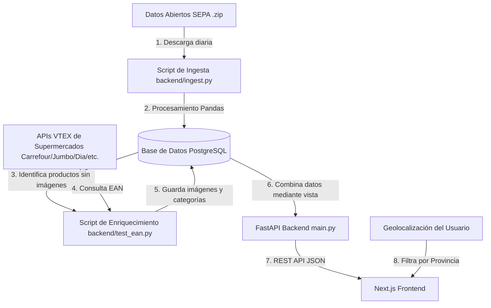

# PrecioAR - Monorepo

Plataforma de búsqueda y comparación en tiempo real de precios de supermercados en Argentina, utilizando datos abiertos del **SEPA** (Sistema Electrónico de Publicidad de Precios Argentinos) y enriquecimiento a través de APIs de e-commerce.

Este repositorio está estructurado como un **monorepo** que unifica tanto el frontend como el backend en un único lugar, facilitando el desarrollo local, el control de versiones y el despliegue de la aplicación.

---

## 🎯 ¿Qué hace PrecioAR?

PrecioAR recopila diariamente la información oficial de precios que los supermercados de Argentina están obligados a reportar al SEPA (dependiente del Ministerio de Economía). A partir de estos datos y de un proceso automatizado de enriquecimiento, la plataforma permite a los usuarios:

1. **Buscar productos en tiempo real:** Encuentra de forma instantánea cualquier artículo disponible en los supermercados de la zona.
2. **Comparar precios entre cadenas:** Muestra la lista de precios (tanto de lista como promociones informadas) para el mismo producto en distintas sucursales.
3. **Filtrar por geolocalización:** Detecta automáticamente la provincia del usuario usando la geolocalización del navegador (con fallback manual) para mostrar únicamente los comercios y precios vigentes en su zona geográfica.
4. **Visualizar productos con imágenes y categorías limpias:** El sistema limpia descripciones crudas e incorpora imágenes y categorías de los productos para mejorar la experiencia de usuario.

---

## ⚙️ Arquitectura del Sistema y Flujo de Datos

El flujo de información y procesamiento de PrecioAR sigue la siguiente estructura:



### Componentes Clave:
* **Base de Datos (PostgreSQL):** Almacena las tablas de `comercios`, `sucursales`, `productos`, `precios` y `productos_vtex`. Utiliza una vista materializada `precios_actuales` para obtener el último precio registrado de forma óptima, y la vista `vista_productos` para combinar la descripción original con los metadatos de imágenes y subcategorías enriquecidas.
* **Ingesta Automática (`backend/ingest.py`):** Descarga el archivo ZIP diario del SEPA correspondiente al día de la semana actual (por ejemplo, `sepa_lunes.zip`). Mediante Pandas procesa en memoria millones de filas y utiliza tablas temporales de PostgreSQL para realizar operaciones de tipo `UPSERT` eficientes sin colisiones de duplicación.
* **Enriquecedor de Catálogo (`backend/test_ean.py`):** Consulta por código de barras (EAN) las plataformas de e-commerce basadas en **VTEX** de las principales cadenas de supermercados en Argentina (`carrefour.com.ar`, `jumbo.com.ar`, `disco.com.ar`, `vea.com.ar`, `diaonline.com.ar`, `changomas.com.ar`). Obtiene nombres de productos legibles, marcas oficiales, imágenes de alta calidad y clasificaciones de categorías.
* **Backend API (FastAPI):** Expone endpoints ultrarrápidos para la búsqueda de productos y consulta de precios filtrados por región.
* **Frontend Web (Next.js + React 19):** Interfaz construida con un diseño premium tipo *glassmorphism* (efecto de vidrio esmerilado), modo oscuro, micro-animaciones dinámicas y soporte nativo para consultar la ubicación física del usuario.

---

## 📁 Estructura del Proyecto

```text
precioar/
├── backend/            # Lógica del servidor, base de datos y ETL
│   ├── database.py     # Configuración de conexión de SQLAlchemy
│   ├── ingest.py       # Descarga e ingesta del set de datos diario de SEPA
│   ├── main.py         # Servidor FastAPI y endpoints REST
│   ├── models.py       # Declaración de modelos SQLAlchemy y Vistas SQL
│   ├── schemas.py      # Esquemas de validación Pydantic
│   ├── setup_db.py     # Creación de tablas, índices y vistas materializadas
│   └── test_ean.py     # Script de enriquecimiento de productos vía APIs de VTEX
├── frontend/           # Aplicación Web moderna
│   ├── src/
│   │   ├── app/        # Next.js App Router (Layouts, Páginas, Estilos globales)
│   │   └── components/ # Componentes compartidos (Navbar, Theme-Toggle, etc.)
│   └── package.json    # Dependencias y scripts de Next.js
├── package.json        # Configuración del monorepo y scripts globales
└── README.md           # Documentación general del proyecto
```

---

## 🚀 Guía de Inicio Rápido

### Prerrequisitos
* **Node.js** (v18 o superior)
* **Python** (v3.10 o superior)
* **PostgreSQL** instalado y corriendo localmente.

---

### 1. Configuración de la Base de Datos
Crea una base de datos en PostgreSQL llamada `precioar`. Por defecto, los scripts están configurados para conectarse con las siguientes credenciales (puedes adaptarlas en `backend/database.py`, `backend/setup_db.py`, `backend/ingest.py` y `backend/test_ean.py`):
* **Host:** `localhost`
* **Puerto:** `5432`
* **Base de Datos:** `precioar`
* **Usuario:** `postgres`
* **Contraseña:** `osopardo`

Crea las tablas, índices y vistas ejecutando:
```bash
cd backend
# Opcional: crea y activa tu entorno virtual de Python
# python -m venv venv && .\venv\Scripts\activate
pip install fastapi uvicorn sqlalchemy psycopg2 pandas requests
python setup_db.py
```

---

### 2. Ingesta de Datos (ETL)
Para descargar los datos del SEPA y cargarlos en tu base de datos local, ejecuta el script de ingesta:
```bash
python ingest.py
```
> [!NOTE]
> Este proceso puede tomar unos minutos dependiendo de tu velocidad de conexión a internet y el rendimiento de tu base de datos, ya que descarga el conjunto de datos completo correspondiente al día de la fecha.

---

### 3. Enriquecimiento de Catálogo (Imágenes y Categorías)
Para buscar las imágenes y categorías correctas usando el código EAN de los productos cargados, ejecuta el script enriquecedor:
```bash
python test_ean.py
```
Este script procesará de forma ordenada un lote de productos consultando las APIs de supermercados como Carrefour, Jumbo y Día.

---

### 4. Ejecución de la Aplicación (Monorepo)

Desde la raíz del proyecto, puedes iniciar ambos servidores de desarrollo simultáneamente:

#### Iniciar el Backend (FastAPI):
```bash
npm run dev:backend
```
El backend estará disponible en `http://localhost:8000`. Puedes probar los endpoints interactivos (Swagger UI) en `http://localhost:8000/docs`.

#### Iniciar el Frontend (Next.js):
Primero instala las dependencias de Node.js en la carpeta frontend:
```bash
cd frontend
npm install
cd ..
```
Luego, desde la raíz del monorepo ejecuta:
```bash
npm run dev:frontend
```
La aplicación web estará disponible en su servidor de desarrollo en `http://localhost:3000`.

---

## 🛠️ Scripts del Monorepo (Raíz)

Ejecuta los siguientes comandos desde la raíz del proyecto para facilitar las tareas comunes:

| Comando | Descripción |
| :--- | :--- |
| `npm run dev:frontend` | Inicia el servidor de desarrollo del frontend (Next.js en el puerto 3000). |
| `npm run dev:backend` | Inicia el servidor de desarrollo del backend (FastAPI + Uvicorn en el puerto 8000). |
| `npm run build:frontend` | Compila la versión optimizada de producción para el frontend. |
| `npm run lint:frontend` | Corre el linter en busca de advertencias y errores en el código Next.js/React. |

---

## 📚 Tecnologías Utilizadas

* **Backend:** Python, FastAPI, SQLAlchemy ORM, Uvicorn, Pandas (ETL/Ingest), PostgreSQL.
* **Frontend:** React 19, Next.js (App Router), TypeScript, Tailwind CSS v4, Lucide Icons, OpenStreetMap API.
